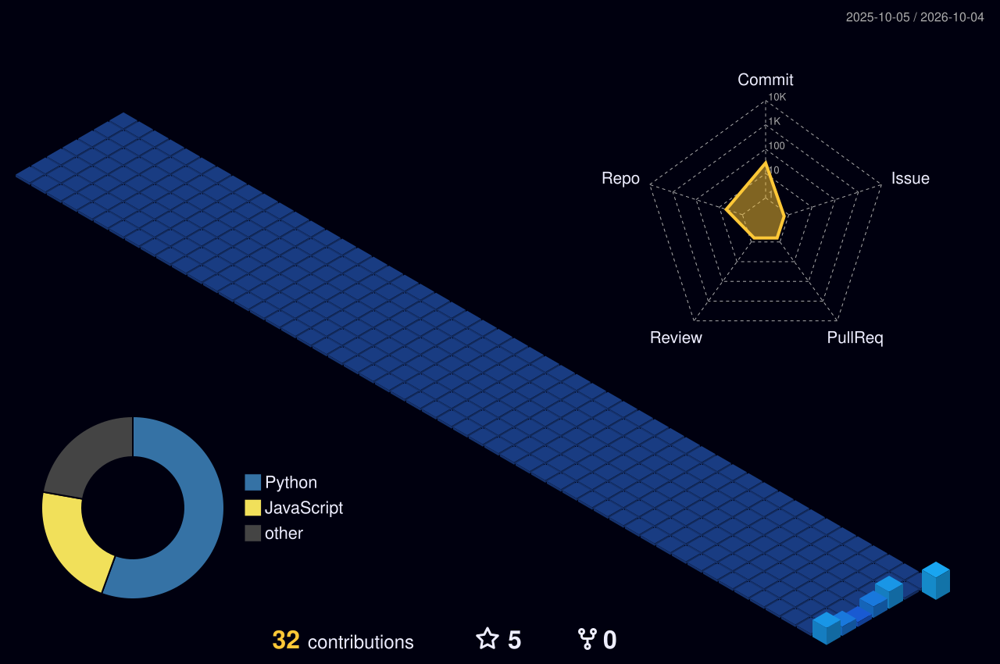

<!-- Dynamic Header Banner -->

  

<!-- Typing Animation & Visitor Badge -->
<h1 align="center">Hi 👋, I'm Atilla ÇAM</h1>
<h3 align="center">A passionate Computer Engineer & AI Enthusiast from Türkiye 🇹🇷</h3>

  

  

 

### 👨‍💻 About Me

Hello! I'm Atilla, a dedicated **Computer Engineer** focused on building intelligent, maintainable, and scalable software solutions. I thrive on solving complex problems and turning innovative ideas into clean, efficient code.

* 🧠 Deeply interested in **Artificial Intelligence**, Machine Learning, and AI-driven automation.
* 💻 Passionate about **Software Architecture**, backend development, and containerization.
* 🌱 Currently focusing on modern frameworks, system optimization, and intelligent API integrations.
* 🚀 Constantly learning and improving my engineering skills to build robust applications.

 

### 🎮 3D Interactive Portfolio

  

  
  

My personal website is a small open world you explore by car: drive between project boards, race against the clock, leave a whisper for the next visitor and discover a few secrets along the way.

* 🚗 **Real vehicle physics** with Rapier — suspension, drifting, boost and self-righting
* 🌦️ **Living world** — day/night cycle, rain & snow, a lake, birds and procedural music generated with Web Audio
* 🗺️ **GPS navigation**, fog-of-war map, race track with a world leaderboard, football pitch, bowling and a shader lab
* 🌐 Turkish / English, mobile joystick, gamepad support and a classic accessible view

  

 

### 🏆 GitHub Trophies

<!-- Bu bölüm senin commit, issue, pull request gibi etkinliklerine göre sana otomatik kupa verir -->

  

 

### 🛠 Tech Stack & Tools

  

 

### 🐍 GitHub Contribution Snake

<!-- Yılanın senin grafiğini yediği animasyon (Aşağıdaki adımları uyguladığında aktif olacak) -->

  <picture>
    <source media="(prefers-color-scheme: dark)" srcset="https://raw.githubusercontent.com/atillacam/atillacam/output/github-contribution-grid-snake-dark.svg">
    <source media="(prefers-color-scheme: light)" srcset="https://raw.githubusercontent.com/atillacam/atillacam/output/github-contribution-grid-snake.svg">
    
  </picture>

 

### 🏙️ 3D Github Katkı Grafiğim

### 🚀 Areas of Expertise

<table>
  <tr>
    <td width="50%">
      <h3>🤖 Artificial Intelligence</h3>
      
Exploring AI integration, LLMs, prompt engineering, and intelligent software automation to solve real-world problems.

    </td>
    <td width="50%">
      <h3>⚙️ Software Engineering</h3>
      
Designing scalable systems, writing clean and maintainable code, and building robust, production-ready applications.

    </td>
  </tr>
  <tr>
    <td width="50%">
      <h3>🐳 DevOps & Architecture</h3>
      
Utilizing Docker for containerization, managing Linux environments, and structuring efficient development workflows.

    </td>
    <td width="50%">
      <h3>🌐 Backend Development</h3>
      
Developing secure APIs, handling server-side logic, and managing databases efficiently.

    </td>
  </tr>
</table>

 

### 📊 GitHub Analytics

  
  

 

<!-- Rastgele değişen yazılımcı sözü kartı -->

  

<!-- Dynamic Footer -->

  

